# Лабораторная работа №2
## Дисциплина: Cloud Computing
## Работа с Amazon EC2
## Выполнил Студент: Бритков Егор, Informatica, I2402
## Выбраный уровень: Продвинутый
## Выбранное приложение: open_capsules_php_functional

**Цель работы:** ознакомиться с основными возможностями AWS EC2, IAM, AWS Budgets, мониторингом экземпляров, SSH-подключением, передачей файлов через SCP и управлением экземпляром через AWS CLI.

---

## Задание 1. Подготовка аккаунта

Для работы был выбран регион **Europe (Frankfurt) — eu-central-1**.

Был создан IAM-пользователь и добавлен в группу `Admins` с политикой `AdministratorAccess`.

Политика `AdministratorAccess` предоставляет полный административный доступ практически ко всем сервисам и ресурсам AWS.

Root-пользователя не рекомендуется использовать для повседневной работы, так как он имеет неограниченный доступ ко всему аккаунту. При компрометации root-учётной записи злоумышленник получает полный контроль над AWS-аккаунтом. Для обычной работы безопаснее использовать IAM-пользователей с необходимыми правами.

Также был создан бюджет `ZeroSpend`, который позволяет получить уведомление при появлении расходов.


**В списке AWS Budgets создан бюджет `ZeroSpend` с нулевым порогом расходов.**

---

## Задание 2. Запуск экземпляра EC2

Был создан экземпляр EC2 со следующими параметрами:

- имя: `webserver`;
- AMI: `Amazon Linux 2023`;
- тип экземпляра: `t3.micro`;
- регион: `eu-central-1`;
- Security Group: `webserver-sg`;
- разрешён SSH-трафик с источником **My IP**;
- разрешён HTTP-трафик с источником **Anywhere**.

Для автоматической установки программ был использован следующий `User data`:

```bash
#!/bin/bash
dnf -y update
dnf -y install htop nginx
systemctl enable --now nginx
```

`User data` позволяет автоматически выполнить команды при первоначальном запуске экземпляра. Данный скрипт устанавливает `htop` и `nginx`, после чего запускает nginx и включает его автоматический запуск.

По умолчанию User data выполняется при первом запуске экземпляра и не запускается повторно при обычной перезагрузке.

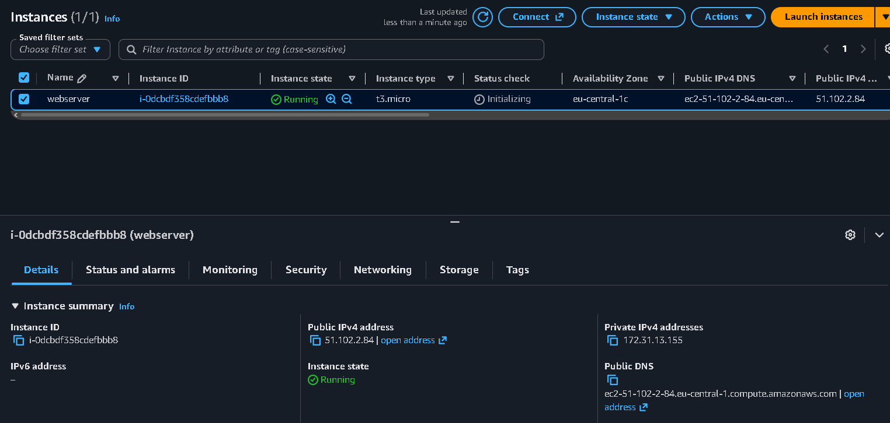

**Экземпляр `webserver` находится в состоянии `Running`, проверки состояния успешно пройдены.**


После запуска nginx была проверена доступность веб-сервера через публичный IP-адрес.

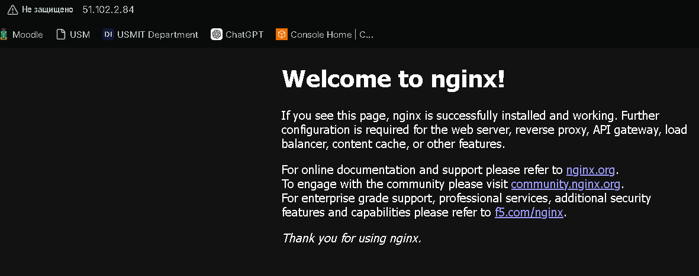

**В браузере по публичному IP-адресу открывается стандартная страница nginx.**

---

## Задание 3. Мониторинг и диагностика

Во вкладке `Status and alarms` доступны проверки состояния экземпляра.

`System status check` показывает проблемы инфраструктуры AWS, например физического сервера или сети.

`Instance status check` показывает проблемы внутри виртуальной машины. Такие проблемы обычно может исправить пользователь, например изменив конфигурацию ОС.

`Attached EBS status check` проверяет доступность подключённых EBS-томов.

Во вкладке `Monitoring` отображаются метрики CloudWatch: загрузка процессора, сетевой трафик и операции с диском.

Детальный мониторинг имеет смысл использовать для критичных серверов, когда необходимо получать данные с интервалом около одной минуты и быстрее реагировать на изменение нагрузки.

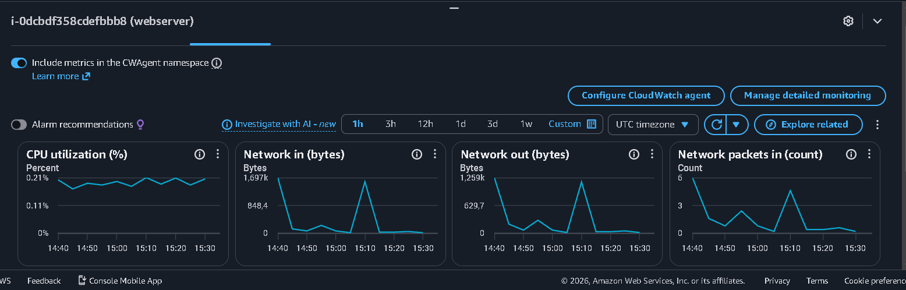

**Во вкладке `Monitoring` отображаются метрики экземпляра EC2.**


В `System log` были найдены сообщения `cloud-init`, подтверждающие установку nginx через User data.

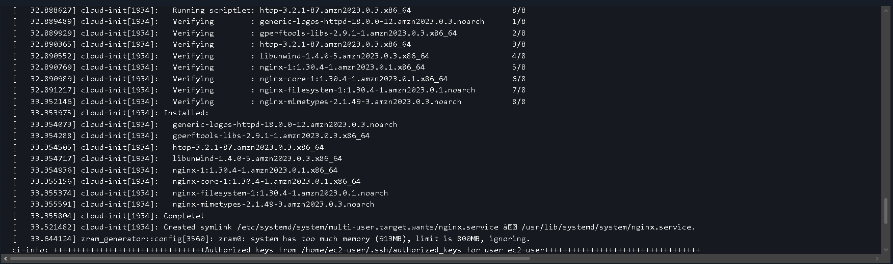

**В журнале `cloud-init` видны строки установки пакетов nginx из скрипта User data.**


---

## Задание 4. Подключение по SSH

Подключение к серверу выполнялось из Windows PowerShell:

```powershell
ssh -i "C:\Users\User\.ssh\Mishuna-keypair.pem" ec2-user@51.102.2.84
```

После подключения была проверена работа nginx:

```bash
systemctl status nginx
```

Сервис находился в состоянии:

```text
Active: active (running)
```

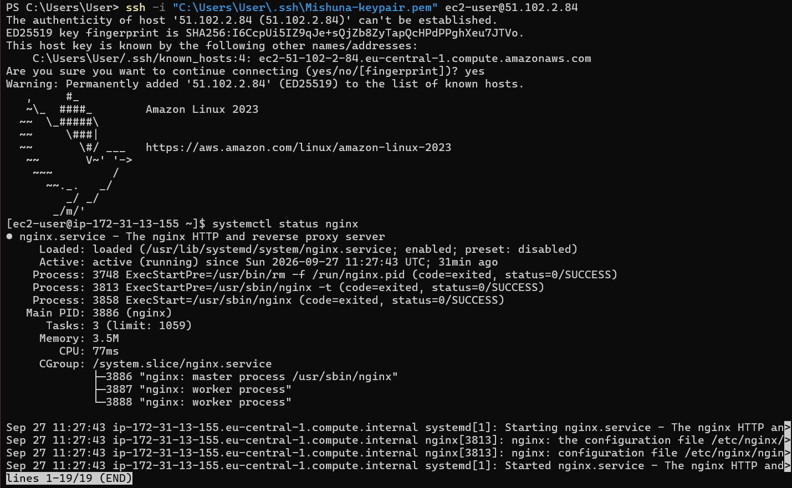

**Выполнено успешное SSH-подключение к EC2, сервис nginx находится в состоянии `active (running)`.**

Для подключения используется ключ вместо обычного пароля, так как аутентификация по SSH-ключам является более безопасной: приватный ключ хранится у пользователя и не передаётся серверу.

---

## Задание 5. Статический сайт

На локальном компьютере были созданы три страницы:

```text
index.html
about.html
contact.html
```

Страницы содержат ссылки друг на друга.

Для передачи файлов на сервер была использована команда:

```powershell
scp -i "C:\Users\User\.ssh\Mishuna-keypair.pem" index.html about.html contact.html ec2-user@51.102.2.84:~
```

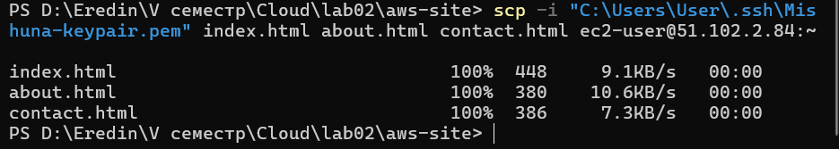

`scp` используется для безопасной передачи файлов через SSH-соединение. Как и `ssh`, команда использует SSH-протокол и может выполнять аутентификацию с помощью приватного ключа.

После передачи файлы были скопированы в директорию nginx:

```bash
sudo cp ~/*.html /usr/share/nginx/html/
```

Содержимое директории было проверено командой:

```bash
ls -l /usr/share/nginx/html
```

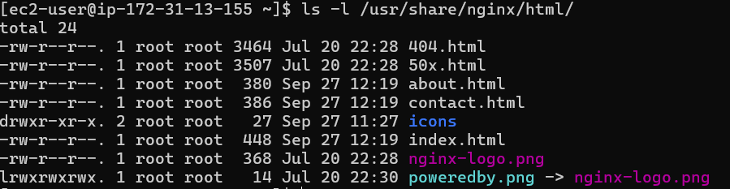

**В директории nginx находятся файлы `index.html`, `about.html` и `contact.html`.**


После этого сайт был открыт через публичный IP-адрес экземпляра.

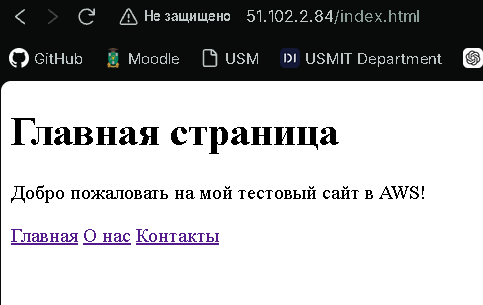

**Созданный статический сайт успешно открывается через nginx по публичному IP-адресу EC2.**


---

## Задание 6. Остановка экземпляра через AWS CLI

Экземпляр был остановлен с помощью AWS CLI:

```bash
aws ec2 stop-instances \
  --instance-ids <ID-экземпляра> \
  --region eu-central-1
```

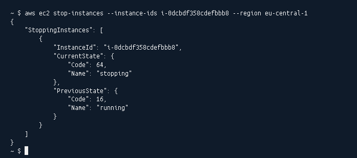

**Экземпляр EC2 остановлен командой `aws ec2 stop-instances` через AWS CLI.**


`Stop` останавливает виртуальную машину, но сохраняет сам экземпляр и его данные на EBS.

`Terminate` полностью удаляет экземпляр. После завершения экземпляра его нельзя снова запустить.

Во время остановки экземпляра плата за вычислительные ресурсы EC2 обычно не начисляется, однако продолжают оплачиваться используемые ресурсы, например EBS-тома и некоторые выделенные сетевые ресурсы.

---

## Задание 7. Организация и репозиторий GitHub

На GitHub была создана организация для проекта и публичный репозиторий `timecapsule`.

Исходный код приложения был скопирован из учебного репозитория и загружен в новый репозиторий организации. В корне репозитория находятся основные директории приложения:

```text
public
src
views
```

а также файл:

```text
composer.json
```

Папка `vendor/` и файл `.env` не попадают в репозиторий, потому что они указаны в `.gitignore`.

`vendor/` содержит зависимости Composer, которые могут быть восстановлены командой `composer install`.

Файл `.env` содержит параметры окружения и может включать пароли и другие секретные данные, поэтому его нельзя хранить в публичном репозитории. Вместо него в репозитории используется файл `.env.example`.

---

## Задание 8. Подготовка сервера

Для продолжения работы был запущен экземпляр EC2 `webserver` и выполнено подключение по SSH.

На сервер были установлены необходимые пакеты:

```bash
sudo dnf -y install git composer postgresql16-server \
php8.4-fpm php8.4-cli php8.4-pgsql php8.4-mbstring php8.4-xml
```

Были установлены:

- Git;
- Composer;
- PostgreSQL 16;
- PHP 8.4;
- PHP-FPM;
- драйвер PostgreSQL для PHP;
- дополнительные модули PHP.

Работа PHP была проверена командой:

```bash
php -v
```

Наличие драйвера PostgreSQL было проверено командой:

```bash
php -m | grep pdo_pgsql
```

Пакеты устанавливались вручную, потому что экземпляр EC2 уже был создан ранее. `User data` в данной конфигурации используется в основном при первоначальном запуске экземпляра и по умолчанию не выполняется повторно после обычного перезапуска.

---

## Задание 9. База данных PostgreSQL

Сначала была выполнена инициализация PostgreSQL:

```bash
sudo postgresql-setup --initdb
```

В файле:

```text
/var/lib/pgsql/data/pg_hba.conf
```

метод аутентификации для локальных TCP-подключений был изменён с `ident` на:

```text
scram-sha-256
```

Это позволило использовать подключение к PostgreSQL по логину и паролю.

После этого PostgreSQL был запущен и добавлен в автозапуск:

```bash
sudo systemctl enable --now postgresql
```

Для приложения был создан отдельный пользователь:

```text
timecapsule
```

и база данных:

```text
timecapsule
```

владельцем которой является пользователь `timecapsule`.

Подключение к базе было проверено командой:

```bash
psql -h localhost -U timecapsule -d timecapsule -c "SELECT 1;"
```

Успешный результат с числом `1` подтвердил, что подключение по паролю работает корректно.

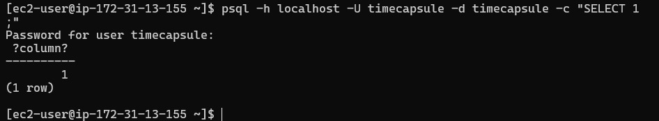

**Успешное подключение к базе данных PostgreSQL и выполнение запроса `SELECT 1;`.**

---

## Задание 10. Развёртывание кода приложения

Для приложения была создана директория:

```text
/var/www/timecapsule
```

и владельцем директории был назначен пользователь `ec2-user`.

Исходный код приложения был загружен из публичного репозитория GitHub:

```bash
git clone https://github.com/<organization>/timecapsule.git /var/www/timecapsule
```

После клонирования в директории приложения находились файлы и папки проекта, включая:

```text
public
src
views
composer.json
```

На сервере был создан файл `.env`, содержащий параметры приложения и подключения к PostgreSQL:

```text
APP_URL=http://<Public-IP>
APP_DEBUG=false

DB_HOST=localhost
DB_PORT=5432
DB_NAME=timecapsule
DB_USER=timecapsule
DB_PASSWORD=ваш-пароль

UPLOAD_DIR=storage/uploads
MAX_UPLOAD_MB=5
MAIL_DELAY_SECONDS=3
AUTH_ENABLED=true
```

Для файла `.env` были настроены права доступа таким образом, чтобы PHP-FPM мог его читать, а посторонние пользователи не имели к нему доступа.

Также владельцем директории `storage` был назначен пользователь `apache`, от имени которого работает PHP-FPM.

Зависимости приложения были установлены командой:

```bash
composer install --no-dev --optimize-autoloader
```

После этого была выполнена инициализация таблиц базы данных:

```bash
php bin/init-db.php
```

Сообщение:

```text
Database is ready
```

подтвердило успешное подключение приложения к PostgreSQL и создание необходимых таблиц.

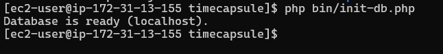

**Скрипт `init-db.php` успешно выполнил подготовку базы данных приложения.**

Пароль базы данных хранится в `.env`, а не в исходном коде, чтобы секретные данные не попадали в систему контроля версий.

Публичный репозиторий безопасен для данного приложения, поскольку в нём хранится только исходный код и шаблон `.env.example`, а реальные пароли и другие секретные параметры находятся только на сервере и исключены из Git через `.gitignore`.

---


## Задание 11. Настройка PHP-FPM и nginx

Для приложения был увеличен максимальный размер загружаемых файлов в PHP:

```bash
sudo sed -i 's/^upload_max_filesize.*/upload_max_filesize = 6M/' /etc/php.ini
```

После этого был создан отдельный конфигурационный файл nginx для приложения TimeCapsule:

```text
/etc/nginx/conf.d/timecapsule.conf
```

В конфигурации был указан корневой каталог приложения:

```text
/var/www/timecapsule/public
```

Также были настроены передача PHP-запросов в PHP-FPM, ограничение размера HTTP-запроса и запрет доступа к скрытым файлам.

Перед перезапуском nginx конфигурация была проверена командой:

```bash
sudo nginx -t
```

Проверка завершилась успешно:

```text
syntax is ok
test is successful
```

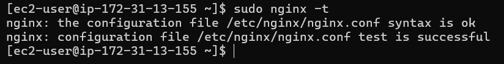

**Успешная проверка конфигурации nginx командой `sudo nginx -t`.**

После этого был запущен и добавлен в автозапуск PHP-FPM:

```bash
sudo systemctl enable --now php-fpm
```

nginx был перезапущен:

```bash
sudo systemctl restart nginx
```

После настройки по публичному IP-адресу стала открываться страница приложения TimeCapsule.

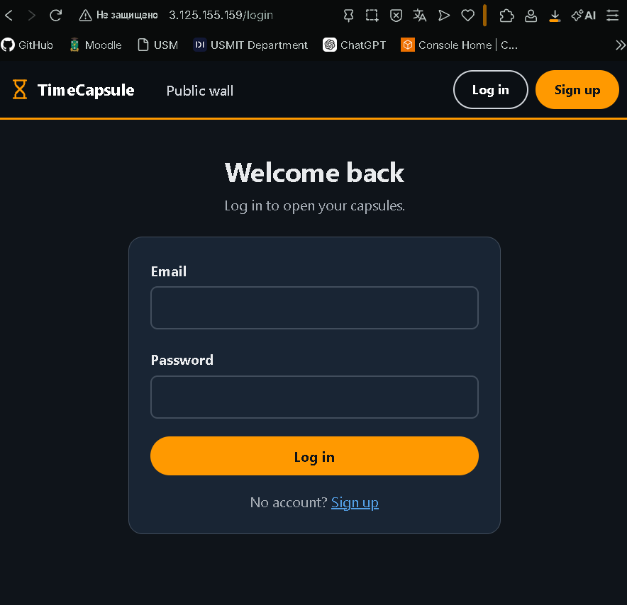

**Приложение TimeCapsule успешно открывается через nginx по публичному IP-адресу.**

Для проверки состояния приложения был открыт адрес:

```text
http://<Public-IP>/health
```

В ответ приложение вернуло статус успешной работы и доступности базы данных.

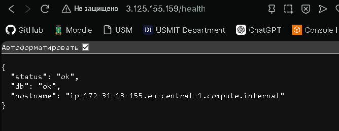

**Endpoint `/health` подтверждает работоспособность приложения и соединение с базой данных.**

---

## Задание 12. Обновление приложения

Для автоматизации обновления приложения на сервере был создан скрипт:

```text
~/deploy.sh
```

Скрипт выполняет следующие действия:

```text
git pull
composer install
php bin/init-db.php
systemctl reload php-fpm
```

Команда:

```bash
set -euo pipefail
```

останавливает выполнение скрипта при возникновении ошибки и предотвращает продолжение некорректного деплоя.

Для получения новых изменений используется:

```bash
git pull --ff-only
```

Эта команда обновляет репозиторий только в случае безопасного fast-forward обновления и не пытается автоматически объединять локальные изменения на сервере.

После создания скрипт был сделан исполняемым:

```bash
chmod +x ~/deploy.sh
```

Затем деплой был запущен удалённо с локального компьютера через SSH:

```powershell
ssh -i "C:\Users\User\.ssh\Mishuna-keypair.pem" ec2-user@<Public-IP> ./deploy.sh
```

SSH выполнил `deploy.sh` на сервере, вывел результат в локальный терминал и завершил соединение автоматически.

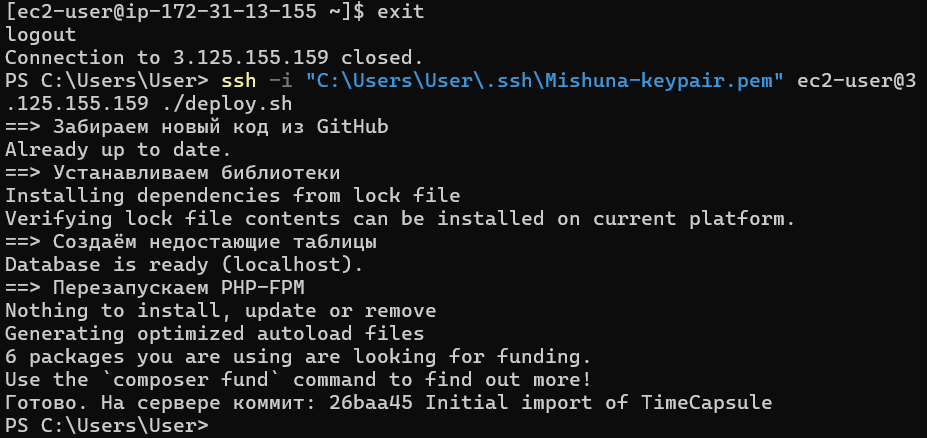

**Скриншот — Скрипт `deploy.sh` успешно запущен удалённо через SSH с локального компьютера.**

Во время обычного `git pull` файлы обновляются последовательно, поэтому в момент деплоя пользователь теоретически может получить временно неконсистентную версию приложения.

Если после обновления кода не выполнить `composer install`, новая версия приложения может не запуститься из-за отсутствующих или устаревших библиотек в директории `vendor`.

---

## Задание 13. Новая версия, поломка и откат

Сначала приложение было проверено в рабочем состоянии. В нём была создана тестовая капсула с прикреплённым файлом.

После этого в локальной версии приложения был изменён файл:

```text
views/layout.php
```

В интерфейс была добавлена заметная строка с именем автора.

Изменение было сохранено в Git:

```bash
git add views/layout.php
git commit -m "Footer editing"
git push
```

После выполнения `deploy.sh` новая версия появилась на сервере.

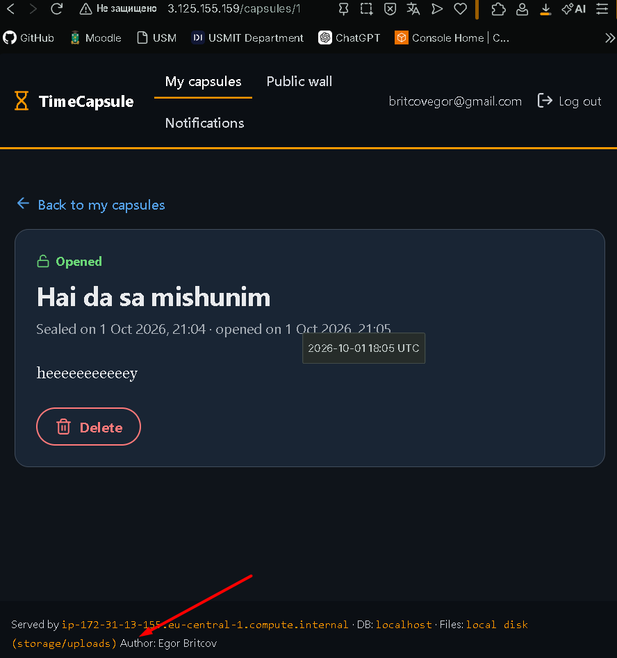

**После деплоя на странице приложения отображается новое изменение в интерфейсе.**

При этом ранее созданная капсула и прикреплённый файл сохранились, так как обновление исходного кода не удаляет данные PostgreSQL и содержимое каталога хранения приложения.

### Проверка ошибочного деплоя

Для проверки процесса восстановления в файл `views/layout.php` была намеренно добавлена синтаксическая ошибка PHP.

Изменение было отправлено в GitHub и развёрнуто на сервере.

После ошибочного деплоя главная страница начала возвращать ошибку HTTP 500.

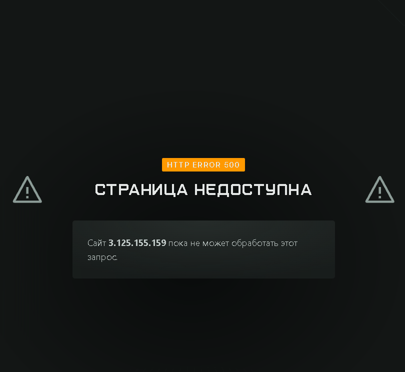

**После развёртывания версии с синтаксической ошибкой приложение возвращает ошибку HTTP 500.**

При этом endpoint:

```text
/health
```

продолжал отвечать успешно.

Это происходит потому, что `/health` проверяет доступность самого приложения и соединение с базой данных, но не обязательно выполняет рендеринг всех шаблонов интерфейса.

Следовательно, успешный ответ `/health` не гарантирует, что каждая пользовательская страница работает корректно.

Для более полной проверки можно дополнительно выполнять запросы к основным пользовательским маршрутам или использовать автоматические тесты интерфейса.

### Откат версии

Исправление выполнялось не непосредственно на сервере, а через Git.

Для отмены последнего ошибочного коммита была выполнена команда:

```bash
git revert --no-edit HEAD
```

В результате был создан новый коммит, отменяющий изменения ошибочной версии без переписывания истории Git.

После этого изменения были отправлены в репозиторий:

```bash
git push
```

и снова выполнен деплой:

```powershell
ssh -i "C:\Users\User\.ssh\Mishuna-keypair.pem" ec2-user@<Public-IP> ./deploy.sh
```

После повторного деплоя приложение снова стало работать.

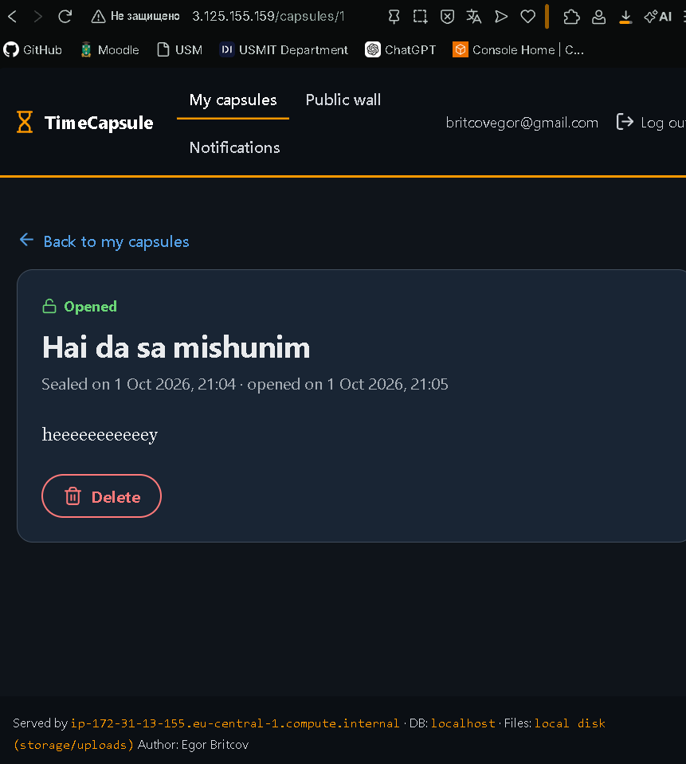

**После `git revert` и повторного деплоя приложение снова работает корректно.**

Время недоступности сайта состояло из времени обнаружения ошибки, создания revert-коммита, отправки его в GitHub и повторного деплоя.

Сократить время простоя можно с помощью автоматических тестов, проверки синтаксиса PHP перед деплоем, CI/CD и механизма автоматического отката при неуспешной проверке новой версии.

---

## Задание 14. Архитектура и решение

Ниже для полноты картины представлена схема развертывания:

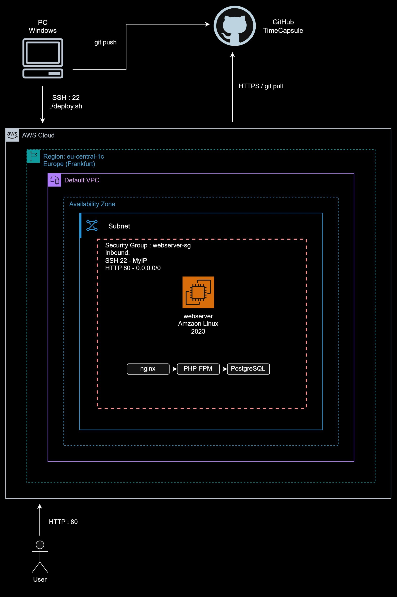

А также ссылка на ADR-файл который описывает архитектурное решение:

[ADR-0001 — Способ деплоя приложения](docs/adr/0001-deploy-method.md)

---

## Контрольные вопросы
### 1. Как проходит запрос от браузера до базы данных в вашем развёртывании? Какую роль играет каждая программа?

Браузер отправляет HTTP-запрос на сервер EC2, где его первым принимает nginx. Если запрос требует выполнения PHP-кода, nginx передаёт его в PHP-FPM, который запускает приложение TimeCapsule. Приложение при необходимости обращается к PostgreSQL, получает или изменяет данные, после чего результат возвращается обратно через PHP-FPM и nginx в браузер.

### 2. Почему сервер может скачивать код из репозитория, но не может отправлять в него изменения? Почему для сервера это правильно?

Репозиторий публичный, поэтому сервер может выполнять git pull по HTTPS без авторизации. Для git push уже нужны права на запись и данные для аутентификации, которых на сервере нет. Это безопаснее, потому что даже при взломе EC2 злоумышленник не сможет через сервер изменить исходный код в GitHub.

### 3. Что произойдёт с загруженными пользователями файлами, если удалить экземпляр EC2? Как это связано с тем, что вы знаете об EBS?

В нашем варианте загруженные файлы находятся на диске экземпляра, в каталоге storage. При обычной остановке EC2 данные на EBS сохраняются, но при Terminate корневой EBS-том обычно удаляется вместе с экземпляром, если для него включено Delete on termination. Поэтому без отдельного резервного хранения или изменения настроек EBS пользовательские файлы можно потерять.

### 4. Что общего у вашего deploy.sh с тем, что делают системы CI/CD? Чего в вашем процессе ещё не хватает?

deploy.sh уже автоматизирует несколько действий деплоя: получает новую версию кода, устанавливает зависимости, обновляет базу и перезагружает PHP-FPM. В CI/CD похожие действия выполняются автоматически после изменений в репозитории и обычно дополняются сборкой, тестами, проверками качества и автоматическим откатом. В нашей реализации запуск пока ручной, а полноценной проверки новой версии перед её публикацией нет.
